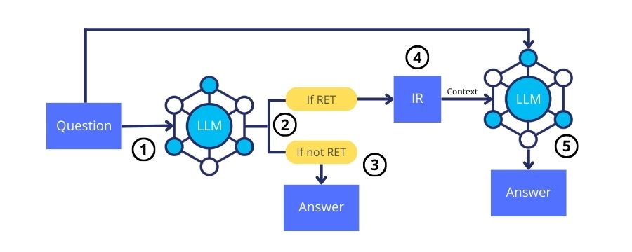

# Adapt-LLM: Adaptive Language Model for Question Answering

Welcome to the official repository for **Adapt-LLM**, an innovative approach to question answering that trains a Large Language Model (LLM) to determine when to respond directly and when to signal the need for additional context using a special token, `<RET>`.



## Installation

To get started with Adapt-LLM, follow these steps:

1. Clone this repository to your local machine.
2. Install the required dependencies by running:
    ```bash
    pip install -r requirements.txt
    ```

## Usage

### Training the Model

To train the Adapt-LLM model, use the following command:

```bash
python train.py \
    --train_path TRAIN_PATH \
    --base_model BASE_MODEL \
    --mode MODE \
    --out_dir OUT_DIR
```

- `TRAIN_PATH`: Path to the training dataset.
- `BASE_MODEL`: The base model to use for training.
- `MODE`: Model configuration (`never_retrieve`, `always_retrieve`, or `hybrid_retrieve` where `hybrid_retrieve` refers to Adapt-LLM).
- `OUT_DIR`: Directory where the trained model will be saved.

### Evaluating the Model

To evaluate the performance of the trained model, run the evaluation script:

```bash
python evaluate.py \
    --data_path DATA_PATH \
    --dataset DATASET \
    --mode MODE \
    --lora LORA \
    --passages_from PASSAGES_FROM \
    --out_dir OUT_DIR
```

- `DATA_PATH`: Path to the directory containing the test set.
- `DATASET`: The test set to be used.
- `MODE`: Model configuration (`never_retrieve`, `always_retrieve`, or `hybrid_retrieve` where `hybrid_retrieve` refers to Adapt-LLM).
- `LORA`: Fine-tuned model to use.
- `PASSAGES_FROM`: Context passages to consider as gold.
- `OUT_DIR`: Directory where the evaluation results will be saved.

## Examples

Here are some example commands to get you started:

### Training

```bash
python train.py \
    --train_path ../generate_dataset/alpaca_format/nq_train_hybrid_retrieve.json \
    --base_model meta-llama/Llama-2-7b-chat-hf \
    --mode hybrid_retrieve 
    --out_dir results_nq/hybrid_retrieve
```

### Evaluation

```bash
python evaluate.py \
    --data_path ../generate_dataset/evaluate_format \
    --dataset popqa \
    --mode hybrid_retrieve \
    --lora results_nq/hybrid_retrieve \
    --passages_from contriever_passage \
    --out_dir results_nq/hybrid_retrieve
```

## License

The resources included in this repository are licensed under the Creative Commons Attribution 4.0 International License. You are free to share and adapt the data, provided that appropriate credit is given. For more information, see the [Creative Commons License](https://creativecommons.org/licenses/by/4.0/deed.en).

## Contact and Citation

For any questions about the code or the methodology, please feel free to [contact us](mailto:tiz.labruna@gmail.com) or open an issue. If you find this repository useful for your research, please consider citing our paper:

```
@article{labruna2024retrieve,
  title={When to Retrieve: Teaching LLMs to Utilize Information Retrieval Effectively},
  author={Labruna, Tiziano and Campos, Jon Ander and Azkune, Gorka},
  journal={arXiv preprint arXiv:2404.19705},
  year={2024}
}
```
